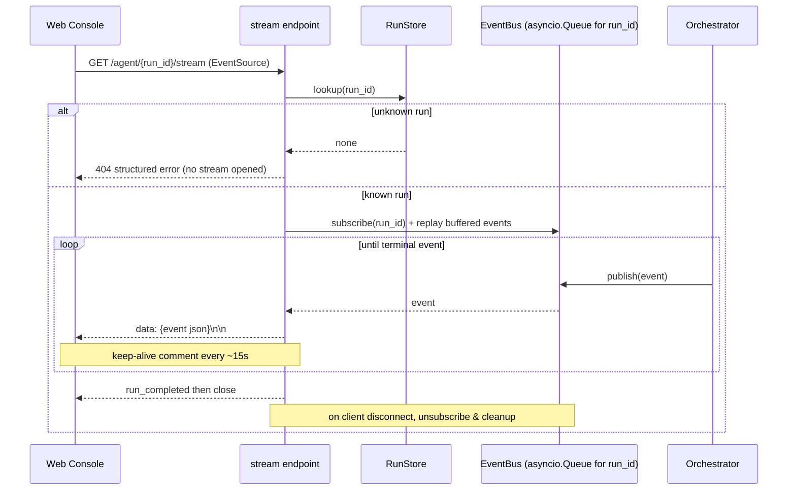

# Design Document: Autonomous Agent Service

## Overview

The Autonomous Agent Service is a locally runnable, production-grade AI system that turns a
natural-language business request into a polished Microsoft Word (`.docx`) deliverable. It
implements a clean **Planner → Executor → Reflector** loop behind a FastAPI backend and streams
the agent's reasoning live to a dark "mission control" single-page web console over Server-Sent
Events (SSE).

The system runs with **zero paid API keys**. It uses the Groq free tier (model
`llama-3.3-70b-versatile`) via the `groq` SDK when `GROQ_API_KEY` is present, and automatically
falls back to a local Ollama backend otherwise. Every LLM call is wrapped with exponential-backoff
retries, JSON repair, and Groq→Ollama fallback.

This design maps directly to the 16 requirements in `requirements.md`. Requirement references
appear throughout in the form **(Req X.Y)**.

### Design Goals

- **Correctness never overstated** — the final status is computed once by a pure function
  `derive_status` and can never report `completed` when a step failed (Req 7).
- **Isolation** — each Run is keyed by `run_id`; SSE events and documents never cross runs (Req 16).
- **Resilience** — retries, JSON repair, backend fallback, per-step failure continuation, and
  best-effort logging keep a Run producing value even under partial failure (Req 2, 3, 4, 15).
- **Observability without fragility** — structured logging degrades gracefully and never breaks a
  Run (Req 15).
- **Testability** — pure functions and clear class contracts make the core amenable to
  property-based testing (see Correctness Properties).

### Technology Stack

| Concern | Choice |
|---|---|
| Language | Python 3.11+ |
| Web framework | FastAPI + Uvicorn (ASGI), fully async |
| Data validation | Pydantic v2 |
| LLM (primary) | Groq free tier, `llama-3.3-70b-versatile`, `groq` SDK |
| LLM (fallback) | Ollama (local) via HTTP |
| Retry/backoff | `tenacity` (or an equivalent hand-rolled async backoff) |
| Document generation | `python-docx` |
| Frontend | Single-page app (plain HTML + vanilla JS), served by FastAPI as static assets |
| Testing | `pytest`, `pytest-asyncio`, `hypothesis` (property-based), `httpx`/`starlette` TestClient |

---

## Architecture

The service is a layered, single-process async application. HTTP and SSE requests enter through the
**API Layer**. A validated request flows through the **Guardrail Validator**, then the
**Orchestrator** wires the **Planner → Executor → Reflector** loop, drives the **DocumentBuilder**,
and publishes events to a per-run **Event Bus**. All shared cross-cutting concerns (config,
logging, rate limiting, run state, event bus) live in `app/core/`.

### Component Diagram

```mermaid
flowchart TB
    subgraph Client
        UI[Mission Control Web Console<br/>single-page app]
    end

    subgraph API[API_Layer  app/api]
        R_AGENT[POST /agent]
        R_STREAM[GET /agent/&#123;run_id&#125;/stream]
        R_DOC[GET /documents/&#123;run_id&#125;.docx]
        R_HEALTH[GET /health]
        R_READY[GET /health/ready]
    end

    subgraph Core[app/core]
        RL[RateLimiter<br/>per-IP sliding window]
        RS[RunStore<br/>run_id to RunState]
        EB[EventBus<br/>asyncio.Queue per run]
        CFG[Config]
        LOG[Structured Logging]
    end

    subgraph Agent[app/agent]
        GV[GuardrailValidator]
        ORCH[Orchestrator]
        PL[Planner]
        EX[Executor]
        RF[Reflector]
        TOOLS[Tools registry<br/>research / draft_section /<br/>generate_table_data / build_docx]
    end

    subgraph Services[app/services]
        LLM[LLMService<br/>Groq primary / Ollama fallback]
        DOCX[DocumentBuilder<br/>python-docx]
    end

    UI -->|POST request| R_AGENT
    UI -->|EventSource subscribe| R_STREAM
    UI -->|Download| R_DOC

    R_AGENT --> RL --> GV --> ORCH
    ORCH --> PL --> LLM
    ORCH --> EX --> TOOLS
    TOOLS --> LLM
    TOOLS --> DOCX
    ORCH --> RF --> LLM
    ORCH --> RS
    ORCH -->|publish events| EB
    R_STREAM -->|subscribe| EB
    R_STREAM --> RS
    R_DOC --> RS
    R_HEALTH --> LLM
    R_READY --> LLM
    GV --> LLM
    LLM -->|Groq SDK| GROQ[(Groq API)]
    LLM -->|HTTP| OLLAMA[(Local Ollama)]
```



### Request Flow (POST /agent)

```mermaid
sequenceDiagram
    participant C as Web Console
    participant API as API_Layer
    participant RL as RateLimiter
    participant GV as GuardrailValidator
    participant O as Orchestrator
    participant P as Planner
    participant E as Executor
    participant R as Reflector
    participant EB as EventBus
    participant RS as RunStore

    C->>API: POST /agent { request }
    API->>RL: check(client_ip)
    alt over limit
        RL-->>API: reject
        API-->>C: 429 + Retry-After
    else allowed
        API->>API: Pydantic validate (422 on fail)
        API->>GV: classify_intent(request)
        alt malicious / non_document
            GV-->>API: rejected
            API-->>C: 422 (+ security_event log if malicious)
        else valid_document_request
            API->>RS: create RunState(run_id=pending)
            API->>O: start run (background task)
            API-->>C: 200 AgentResponse (after run finishes)
            Note over O,EB: Run executes; events published to EventBus
            O->>EB: planning_started
            O->>P: make_plan(request)
            O->>EB: plan_created
            loop each PlanStep
                O->>EB: step_started
                O->>E: execute(step)
                O->>EB: step_completed | step_failed
            end
            O->>R: reflect(output, request)
            O->>EB: reflection
            O->>RS: status = derive_status(...)
            O->>EB: run_completed
        end
    end
```

### SSE Event Flow (GET /agent/{run_id}/stream)



---

## Project Structure

The codebase follows the layered layout mandated by Req 13.1. Only the files listed below are
created; each module carries full type hints and docstrings (Req 13.2).

```
autonomus-site/
├── app/
│   ├── __init__.py
│   ├── main.py                     # FastAPI app factory, router mounting, static files, lifespan
│   ├── api/
│   │   ├── __init__.py
│   │   ├── agent.py                # POST /agent, GET /agent/{run_id}/stream
│   │   ├── documents.py            # GET /documents/{run_id}.docx
│   │   └── health.py               # GET /health, GET /health/ready
│   ├── agent/
│   │   ├── __init__.py
│   │   ├── orchestrator.py         # Orchestrator + derive_status pure function
│   │   ├── planner.py              # Planner
│   │   ├── executor.py             # Executor
│   │   ├── reflector.py            # Reflector
│   │   ├── guardrail.py            # GuardrailValidator
│   │   └── tools.py                # Tool registry + tool implementations
│   ├── services/
│   │   ├── __init__.py
│   │   ├── llm.py                  # LLMService (Groq primary / Ollama fallback)
│   │   └── docx_builder.py         # DocumentBuilder
│   ├── models/
│   │   ├── __init__.py
│   │   └── schemas.py              # All Pydantic v2 models + enums
│   └── core/
│       ├── __init__.py
│       ├── config.py               # Settings loaded from env (pydantic-settings)
│       ├── logging.py              # Structured logging + safe fallback
│       ├── rate_limiter.py         # In-memory per-IP sliding window
│       ├── run_store.py            # In-memory run_id -> RunState store
│       └── event_bus.py            # asyncio.Queue per run, subscribe/publish/replay
├── frontend/
│   ├── index.html                  # Mission control single-page console
│   ├── app.js                      # SSE subscription + timeline rendering
│   └── styles.css                  # Dark theme, amber accent, monospace logs
├── tests/
│   ├── __init__.py
│   ├── conftest.py                 # fixtures: app client, fake LLM backend
│   ├── test_derive_status.py       # property tests for status derivation
│   ├── test_planner.py             # plan schema / step numbering property tests
│   ├── test_llm_json_repair.py     # JSON repair property tests
│   ├── test_event_isolation.py     # SSE run isolation property tests
│   ├── test_docx_builder.py        # docx parse/structure property tests
│   ├── test_response_contract.py   # response required-fields property tests
│   ├── test_api.py                 # endpoint example/integration tests
│   └── test_rate_limiter.py        # sliding-window tests
├── README.md                       # setup, architecture diagram, test inputs, improvements
├── .env.example                    # every env var, placeholders + comments
├── requirements.txt                # pinned dependencies
└── pyproject.toml                  # project metadata + tool config (ruff, pytest)
```

---

## Data Models

All models are Pydantic v2 (`app/models/schemas.py`). Enums are `str, Enum` so they serialize as
plain strings in JSON and SSE payloads.

### Enums

```python
class RunStatus(str, Enum):
    PENDING   = "pending"
    RUNNING   = "running"
    COMPLETED = "completed"
    PARTIAL   = "partial"
    FAILED    = "failed"

class StepStatus(str, Enum):
    PENDING = "pending"
    RUNNING = "running"
    DONE    = "done"
    FAILED  = "failed"
    SKIPPED = "skipped"   # UI-derived terminal state for unexecuted steps (Req 11.5)

class IntentClass(str, Enum):
    VALID_DOCUMENT_REQUEST = "valid_document_request"
    MALICIOUS              = "malicious"
    NON_DOCUMENT           = "non_document"

class SSEEventType(str, Enum):
    PLANNING_STARTED = "planning_started"
    PLAN_CREATED     = "plan_created"
    STEP_STARTED     = "step_started"
    STEP_COMPLETED   = "step_completed"
    STEP_FAILED      = "step_failed"
    REFLECTION       = "reflection"
    RUN_COMPLETED    = "run_completed"
```

### Request / Plan / Response models

```python
class AgentRequest(BaseModel):
    request: str = Field(min_length=1, description="Natural-language business request")

    @field_validator("request")
    @classmethod
    def not_blank(cls, v: str) -> str:
        if not v.strip():
            raise ValueError("request must not be empty or whitespace")
        return v

class PlanStep(BaseModel):
    step: int = Field(ge=1, description="1-based sequential step number")
    task: str
    description: str
    expected_output: str
    status: StepStatus = StepStatus.PENDING
    output_summary: str | None = None
    error: str | None = None
    depends_on: list[int] = Field(default_factory=list)  # step numbers this step needs

class Plan(BaseModel):
    steps: list[PlanStep] = Field(min_length=2)   # at least two steps (Req 2.1)
    assumptions: list[str] = Field(default_factory=list)

    @model_validator(mode="after")
    def steps_sequential(self) -> "Plan":
        # step numbers must be exactly 1..n in order (Req 2.1, property P2)
        expected = list(range(1, len(self.steps) + 1))
        if [s.step for s in self.steps] != expected:
            raise ValueError("plan step numbers must be sequential starting at 1")
        return self

class AgentResponse(BaseModel):
    run_id: str
    status: RunStatus
    plan: Plan
    assumptions: list[str] = Field(default_factory=list)
    clarifications_resolved: list[str] = Field(default_factory=list)
    summary: str = ""
    document_url: str | None = None   # present only when artifact exists (Req 8.1)
```

### SSE event models

A discriminated union keyed on `type`. Every event carries `run_id`, `type`, and `timestamp`
(Req 6.2).

```python
class BaseEvent(BaseModel):
    run_id: str
    type: SSEEventType
    timestamp: datetime = Field(default_factory=lambda: datetime.now(timezone.utc))

class PlanningStartedEvent(BaseEvent):
    type: Literal[SSEEventType.PLANNING_STARTED] = SSEEventType.PLANNING_STARTED

class PlanCreatedEvent(BaseEvent):
    type: Literal[SSEEventType.PLAN_CREATED] = SSEEventType.PLAN_CREATED
    plan: Plan
    assumptions: list[str] = Field(default_factory=list)

class StepStartedEvent(BaseEvent):
    type: Literal[SSEEventType.STEP_STARTED] = SSEEventType.STEP_STARTED
    step: int
    task: str

class StepCompletedEvent(BaseEvent):
    type: Literal[SSEEventType.STEP_COMPLETED] = SSEEventType.STEP_COMPLETED
    step: int
    output_summary: str

class StepFailedEvent(BaseEvent):
    type: Literal[SSEEventType.STEP_FAILED] = SSEEventType.STEP_FAILED
    step: int
    error: str

class ReflectionEvent(BaseEvent):
    type: Literal[SSEEventType.REFLECTION] = SSEEventType.REFLECTION
    findings: str
    revised_sections: list[str] = Field(default_factory=list)

class RunCompletedEvent(BaseEvent):
    type: Literal[SSEEventType.RUN_COMPLETED] = SSEEventType.RUN_COMPLETED
    status: RunStatus
    summary: str
    document_url: str | None = None

AgentEvent = Annotated[
    Union[PlanningStartedEvent, PlanCreatedEvent, StepStartedEvent,
          StepCompletedEvent, StepFailedEvent, ReflectionEvent, RunCompletedEvent],
    Field(discriminator="type"),
]
```

### Health & error models

```python
class HealthResponse(BaseModel):
    status: str = "ok"
    llm_backend: str            # "groq" | "ollama" | "unknown"
    backend_ready: bool
    detail: str | None = None   # explanatory string when backend unresolved (Req 5.5)

class FieldError(BaseModel):
    field: str
    message: str

class ValidationErrorBody(BaseModel):       # 422 schema failure (Req 1.2)
    error: str = "validation_error"
    fields: list[FieldError]

class RejectionErrorBody(BaseModel):        # 422 guardrail rejection (Req 1.4)
    error: str = "request_rejected"
    reason: IntentClass
    message: str

class PlanningFailureBody(BaseModel):       # 503 planning failure (Req 2.6)
    error: str = "planning_failed"
    run_id: str
    reason: str
    retry_history: list["RetryAttempt"]

class RetryAttempt(BaseModel):
    backend: str
    attempt: int
    error: str
    delay_seconds: float

class DocumentNotFoundBody(BaseModel):      # 404 document (Req 9.4)
    error: str = "document_not_found"
    reason: Literal["unknown_run", "in_progress", "failed_no_document"]

class RunNotFoundBody(BaseModel):           # 404 stream / any run lookup (Req 6.3, 16.4)
    error: str = "run_not_found"
    run_id: str
```

### RunState (stored per run_id)

The in-memory record the RunStore keeps for each Run. It holds everything the response, the stream,
and the document endpoints need (Req 16.1).

```python
class RunState(BaseModel):
    run_id: str
    request: str
    client_ip: str
    status: RunStatus = RunStatus.PENDING
    plan: Plan | None = None
    assumptions: list[str] = Field(default_factory=list)
    clarifications_resolved: list[str] = Field(default_factory=list)
    summary: str = ""
    document_path: Path | None = None          # filesystem path once built
    document_url: str | None = None            # /documents/{run_id}.docx once artifact exists
    reflection_findings: str | None = None
    events: list[AgentEvent] = Field(default_factory=list)  # replay buffer (Req 6, late subscriber)
    created_at: datetime = Field(default_factory=lambda: datetime.now(timezone.utc))
    finished_at: datetime | None = None

    model_config = ConfigDict(arbitrary_types_allowed=True)
```

> `artifact_exists` used by `derive_status` is defined as `document_path is not None and
> document_path.exists()`.

---

## Components and Interfaces

Signatures are illustrative contracts; each carries full type hints and docstrings (Req 13.2).

### LLMService (`app/services/llm.py`) — Req 5, 2.4, 2.5

Responsibilities: resolve the active backend, execute completions with retry/backoff, repair
malformed JSON, and fall back Groq→Ollama. It is the single choke point for every LLM call.

```python
class LLMService:
    def __init__(self, settings: Settings) -> None: ...

    @property
    def active_backend(self) -> str:
        """'groq' when GROQ_API_KEY set, else 'ollama', 'unknown' until resolved (Req 5.1, 5.2, 5.5)."""

    async def complete(self, prompt: str, *, system: str | None = None,
                       temperature: float = 0.2, max_tokens: int = 2048) -> str:
        """Free-form completion with <=3 exponential-backoff retries and Groq->Ollama fallback (Req 5.3)."""

    async def complete_json(self, prompt: str, schema: type[BaseModel], *,
                            system: str | None = None) -> BaseModel:
        """Completion constrained to JSON. On parse failure, runs a JSON-repair pass, then retries;
        raises LLMJSONError only after all retries+repair fail on all backends (Req 2.4, property P6)."""

    async def health(self) -> tuple[str, bool]:
        """Return (backend_name, reachable). Used by /health and /health/ready (Req 5.4, 5.6)."""
```

Internal helpers:
- `_with_backoff(fn)` — wraps a coroutine with tenacity-style exponential backoff, max 3 attempts.
- `_repair_json(raw: str) -> str` — strips code fences, extracts the first balanced `{...}`/`[...]`,
  fixes trailing commas, then re-attempts parse. If still invalid, signals a clean failure.
- `_call_groq(...)`, `_call_ollama(...)` — backend-specific transports. Fallback order:
  primary backend attempts → on exhaustion, secondary backend attempts.

### GuardrailValidator (`app/agent/guardrail.py`) — Req 1

```python
class GuardrailValidator:
    def __init__(self, llm: LLMService) -> None: ...

    async def classify(self, request: str) -> IntentClass:
        """LLM intent classification returning exactly one of the three IntentClass values (Req 1.3).
        Uses complete_json with a tiny enum schema; defaults to a conservative decision on ambiguity."""
```

Pydantic schema validation itself is handled at the API boundary (FastAPI request model), so a
blank/absent `request` yields 422 before the validator is invoked (Req 1.1, 1.2). On `malicious`,
the API layer logs a `security_event` with a hash of the request rather than the payload (Req 1.5).

### Planner (`app/agent/planner.py`) — Req 2

```python
class Planner:
    def __init__(self, llm: LLMService) -> None: ...

    async def make_plan(self, request: str) -> Plan:
        """Produce a strict-JSON Plan with >=2 steps and enumerated assumptions (Req 2.1-2.3).
        Delegates retry/backoff/JSON-repair/fallback to LLMService.complete_json.
        Raises PlanningError (mapped to 503 with retry history) if all backends fail (Req 2.6)."""
```

The plan prompt instructs the model to emit sequential steps and to enumerate assumptions for any
ambiguity. The `Plan` model's validators enforce `>=2` steps and sequential numbering; a violating
LLM output is treated as unparseable and triggers repair+retry.

### Tools registry (`app/agent/tools.py`) — Req 3.2

A registry mapping tool name → async callable, enabling tool-calling dispatch by the Executor.

```python
@dataclass
class ToolResult:
    output: str            # textual result / section content
    data: dict | None = None   # structured payload (e.g. table rows)
    summary: str = ""

ToolFn = Callable[..., Awaitable[ToolResult]]

class ToolRegistry:
    def register(self, name: str, fn: ToolFn) -> None: ...
    def get(self, name: str) -> ToolFn: ...
    async def dispatch(self, name: str, **kwargs) -> ToolResult:
        """Look up and invoke a tool by name with keyword args; raises ToolError on unknown tool."""

# Registered tools (Req 3.2):
async def research(topic: str) -> ToolResult: ...
async def draft_section(title: str, context: str) -> ToolResult: ...
async def generate_table_data(spec: str) -> ToolResult: ...
async def build_docx(sections: list[dict]) -> ToolResult: ...   # delegates to DocumentBuilder
```

Dispatch design: each `PlanStep.task` maps (via a small keyword/LLM router) to a registered tool
name and argument set. `research`, `draft_section`, and `generate_table_data` call `LLMService`;
`build_docx` calls `DocumentBuilder` and records the artifact path on the RunState.

### Executor (`app/agent/executor.py`) — Req 3

```python
class Executor:
    def __init__(self, tools: ToolRegistry, events: EventBus, logger: StructuredLogger) -> None: ...

    async def run(self, run_state: RunState) -> None:
        """Execute plan steps sequentially. For each step: set running + emit step_started,
        dispatch the tool (with retry), then set done/failed + emit step_completed/step_failed
        (Req 3.1, 3.3). On failure, mark failed, record error, and continue with remaining steps
        whose depends_on are all done (Req 3.4). Best-effort on bookkeeping errors (Req 3.5)."""

    def _dependencies_satisfied(self, step: PlanStep, plan: Plan) -> bool:
        """True when every step in step.depends_on has status DONE. Steps with an unsatisfiable
        dependency are left PENDING (rendered 'skipped' by the UI, Req 11.5)."""
```

### Reflector (`app/agent/reflector.py`) — Req 4

```python
class Reflector:
    def __init__(self, llm: LLMService, events: EventBus, logger: StructuredLogger) -> None: ...

    async def reflect(self, run_state: RunState, assembled_output: str) -> ReflectionResult:
        """Single-pass self-check comparing assembled output to the original request.
        Performs at most ONE revision pass then stops (Req 4.2). Records findings in the run log
        and emits a reflection event (Req 4.3). Best-effort: reflection failure never fails the Run."""
```

### Orchestrator (`app/agent/orchestrator.py`) — Req 3, 4, 7, 8, 16

```python
class Orchestrator:
    def __init__(self, validator: GuardrailValidator, planner: Planner, executor: Executor,
                 reflector: Reflector, doc_builder: DocumentBuilder,
                 store: RunStore, events: EventBus, logger: StructuredLogger) -> None: ...

    async def execute_run(self, run_state: RunState) -> AgentResponse:
        """End-to-end run: emit planning_started -> plan (plan_created) -> execute steps ->
        reflect (reflection) -> assemble document -> derive_status once -> emit run_completed.
        All state mutations go through the run's RunState in the RunStore, isolated by run_id (Req 16.1).
        Returns the AgentResponse used as the /agent HTTP body (Req 8.1)."""
```

```python
def derive_status(steps: list[PlanStep], artifact_exists: bool, summary: str) -> RunStatus:
    """Pure function computing the final Run status exactly once (Req 7.2).

    Rules (Req 7.3-7.5):
      - completed: every step is DONE AND artifact_exists AND summary is non-empty
      - failed:    at least one step FAILED AND not artifact_exists  (no usable document)
      - partial:   at least one step FAILED AND artifact_exists       (usable document produced)
      - partial:   no step FAILED but 'completed' preconditions unmet AND artifact_exists
      - failed:    otherwise (no usable document and not completable)
    Never returns 'completed' when any step is FAILED (property P1)."""
```

### DocumentBuilder (`app/services/docx_builder.py`) — Req 10, 14.3-14.5

```python
class DocumentBuilder:
    def __init__(self, theme_color: str, logger: StructuredLogger) -> None:
        """Resolve theme_color from the Theme_Color env var; on unset/invalid value, apply the
        documented default, emit a structured warning, and continue (Req 14.3, 14.4, 14.5)."""

    def build(self, *, title: str, prepared_by: str, sections: list[Section],
              output_path: Path) -> Path:
        """Assemble a .docx with: cover page (title, generation date, prepared-by line),
        table of contents, theme-colored styled headings, body text, >=1 table, >=1 bullet list,
        and footer page numbers (Req 10.1). Returns the written path."""
```

Structural details:
- **Cover page** — title (styled, theme color), generation date, "Prepared by" line, page break.
- **Table of contents** — inserts a Word TOC field (`TOC \o "1-3"`). Because python-docx does not
  compute field results, the builder inserts the field plus an "Update fields on open" instruction
  and a settings flag (`w:updateFields`) so Word refreshes the TOC on first open.
- **Headings** — `Heading 1/2` styles with `run.font.color.rgb = RGBColor.from_string(theme_hex)`.
- **Tables** — a styled table (`Table Grid` / banded) from `generate_table_data` output.
- **Bullet lists** — `List Bullet` style paragraphs.
- **Footer page numbers** — `PAGE` field in the section footer.

### EventBus (`app/core/event_bus.py`) — Req 6, 16.2

```python
class EventBus:
    def __init__(self) -> None:
        self._queues: dict[str, list[asyncio.Queue[AgentEvent]]] = {}  # run_id -> subscriber queues

    async def publish(self, event: AgentEvent) -> None:
        """Append to the run's replay buffer (on RunState) and fan out to all live subscriber
        queues for event.run_id only (Req 16.2). Never raises to the caller."""

    async def subscribe(self, run_id: str) -> asyncio.Queue[AgentEvent]:
        """Create and register a fresh queue for a subscriber of this run_id."""

    def unsubscribe(self, run_id: str, queue: asyncio.Queue) -> None:
        """Remove a subscriber queue on client disconnect and drop empty run entries (cleanup)."""
```

Isolation guarantee: `publish` keys strictly on `event.run_id`, so a subscriber to run A can never
receive run B's events (property P4, Req 16.2).

### RunStore (`app/core/run_store.py`) — Req 16.1, 16.4

```python
class RunStore:
    def __init__(self) -> None:
        self._runs: dict[str, RunState] = {}

    def create(self, run_id: str, request: str, client_ip: str) -> RunState: ...
    def get(self, run_id: str) -> RunState | None:
        """Return the RunState or None (None -> 404 with distinguishing body, Req 6.3, 9.4, 16.4)."""
    def update(self, run_state: RunState) -> None: ...
```

In-memory dict keyed by `run_id`; each RunState is mutated only by its own run's coroutine, giving
concurrency isolation in a single event loop (Req 16.1).

### RateLimiter (`app/core/rate_limiter.py`) — Req 1.6, 1.7

```python
class RateLimiter:
    def __init__(self, limit: int = 10, window_seconds: int = 60) -> None:
        self._hits: dict[str, deque[float]] = {}   # client_ip -> monotonic timestamps

    def check(self, client_ip: str) -> RateDecision:
        """Sliding window: evict timestamps older than window; if count >= limit, deny.
        Returns RateDecision(allowed, retry_after). retry_after is best-effort; if it cannot be
        computed the request is still denied with 429 (Req 1.6, 1.7)."""
```

### StructuredLogger (`app/core/logging.py`) — Req 15

```python
class StructuredLogger:
    def decision(self, component: str, run_id: str, decision: str, **fields) -> None:
        """Emit a structured JSON log for a Planner/Executor/Reflector decision (Req 15.1).
        On failure, attempt a single stderr fallback write and swallow the error so logging never
        breaks a Run (Req 15.2)."""

    def security_event(self, client_ip: str, request_hash: str, reason: str) -> None:
        """Emit a security_event with timestamp, IP, request hash, reason — never the payload (Req 1.5)."""
```

---

## API Design

Base URL is the app root. All JSON bodies are Pydantic models above.

### POST /agent — Req 1, 2, 8

- **Request body**: `AgentRequest` `{ "request": "<non-empty string>" }`
- **Flow**: rate-limit check → schema validation → guardrail classification → run execution →
  synchronous `AgentResponse`.
- **Responses**:
  | Status | Body | Condition |
  |---|---|---|
  | 200 | `AgentResponse` | Run finished (any of completed/partial/failed reported in `status`) |
  | 422 | `ValidationErrorBody` | Body fails Pydantic schema (Req 1.2) |
  | 422 | `RejectionErrorBody` | Guardrail classifies malicious/non_document (Req 1.4) |
  | 429 | (empty/JSON) + `Retry-After` header | Over the per-IP limit (Req 1.6, 1.7) |
  | 503 | `PlanningFailureBody` | Planning failed on all backends (Req 2.6) |
- **Headers**: `Content-Type: application/json`; `Retry-After: <seconds>` on 429.

> **Execution model (chosen approach):** `POST /agent` runs the agent server-side and returns the
> full `AgentResponse` when the Run finishes (synchronous contract, Req 8.1). The `run_id` is created
> and stored *before* execution begins, and the Orchestrator publishes SSE events to the run's queue
> throughout execution. The Web Console issues the POST and, using the `run_id` (surfaced immediately
> — see Frontend design), opens the SSE stream to visualize progress while the POST is in flight.

### GET /agent/{run_id}/stream — Req 6, 16.2

- **Response**: `200 text/event-stream` SSE (see SSE section) — or `404 RunNotFoundBody` when
  `run_id` is unknown, without opening a stream (Req 6.3).
- **Headers**: `Content-Type: text/event-stream`, `Cache-Control: no-cache`,
  `Connection: keep-alive`, `X-Accel-Buffering: no`.

### GET /documents/{run_id}.docx — Req 9, 16.3

- **Responses**:
  | Status | Body | Condition |
  |---|---|---|
  | 200 | file bytes | Artifact exists (Req 9.1, 9.2) |
  | 404 | `DocumentNotFoundBody` reason `unknown_run` | run_id unknown |
  | 404 | `DocumentNotFoundBody` reason `in_progress` | run exists, still running |
  | 404 | `DocumentNotFoundBody` reason `failed_no_document` | run finished, no usable artifact |
- **Headers (200)**: `Content-Type: application/vnd.openxmlformats-officedocument.wordprocessingml.document`;
  `Content-Disposition: attachment; filename="agent-run-{run_id}.docx"` (Req 9.3).

### GET /health — Req 5.4, 5.5

- **200** `HealthResponse` with `llm_backend` = active backend name and `backend_ready`. When the
  backend is unresolved: `llm_backend="unknown"`, `backend_ready=false`, and a `detail` string
  (Req 5.5). `/health` always returns 200.

### GET /health/ready — Req 5.6

- **200** `HealthResponse` when a backend is reachable; **503** when no LLM backend is reachable.

---

## SSE Streaming Design — Req 6, 16.2

### Publishing

The Orchestrator calls `event_bus.publish(event)` at each milestone. `publish` does two things:

1. Appends the event to `RunState.events` (the **replay buffer**).
2. Fan-outs the event to every currently registered subscriber queue for that `run_id`.

### Consuming (stream endpoint)

1. Look up the run; if unknown → `404` immediately, no stream (Req 6.3).
2. `subscribe(run_id)` to get a fresh queue.
3. **Replay** all buffered events from `RunState.events` first, so a **late subscriber** (a console
   that opens the stream after some events already fired) still sees the full history.
4. Then loop: `await queue.get()`, format as an SSE frame, `yield`.
5. Stop after a **terminal event** (`run_completed`), then close the stream.

### SSE frame format

Each event is serialized as JSON and framed per the SSE spec:

```
event: step_completed
id: <monotonic index>
data: {"run_id":"...","type":"step_completed","timestamp":"...","step":2,"output_summary":"..."}

```

(blank line terminates the frame). The `event:` line mirrors `type`; the `id:` supports client
`Last-Event-ID` resumption.

### Keep-alive, disconnect, cleanup

- **Keep-alive**: emit an SSE comment line (`: keep-alive`) every ~15s of idleness so proxies do not
  close the connection.
- **Client disconnect**: detected via `await request.is_disconnected()` / generator `GeneratorExit`;
  the endpoint calls `unsubscribe(run_id, queue)` to remove the queue and drop empty run entries.
- **Terminal cleanup**: after `run_completed` is delivered, the generator returns and the queue is
  unsubscribed.

Because queues are keyed by `run_id`, a stream only ever yields its own run's events (property P4,
Req 16.2).

---

## Frontend Design — Req 11, 12

A single-page "mission control" console (`frontend/index.html` + `app.js` + `styles.css`), served
as static files by FastAPI. Vanilla JS + native `EventSource`; no build step.

### States

1. **Idle** (Req 11.1, 11.2): a large centered input, a one-line service description, and example
   request **chips**. The Plan_Step timeline is **hidden** so its appearance signals a Run has begun.
2. **Running** (Req 11.3, 11.4): on submit, the console POSTs to `/agent` and opens the SSE stream;
   an **animated timeline** renders each Plan_Step in its live state and updates a step's state
   **only** in response to the matching SSE event.
3. **Finished** (Req 11.7): a **result card** shows the summary, the final status (including
   `partial` with per-step detail), and a **Download .docx** button when an artifact exists.

### Submit flow (chosen approach)

To reconcile the synchronous `/agent` contract (Req 8) with live streaming (Req 6), the console:

1. Generates nothing itself — it needs the server's `run_id`. To get the `run_id` before the POST
   resolves, `POST /agent` sets a **`X-Run-Id` response header early** is *not* used (headers can't
   precede the synchronous body cleanly). Instead the console uses this reliable sequence:
   - Issue `POST /agent` (fetch).
   - The server creates the `run_id` and immediately writes it into the RunStore, then executes.
   - The response, when it returns, includes `run_id`. Meanwhile, to stream *during* execution, the
     console derives the `run_id` from a lightweight **`POST /agent` that returns `run_id` first**
     is avoided; instead the console opens the stream using the `run_id` returned in the JSON body
     and **replays** buffered events (the replay buffer guarantees no events are missed, even though
     the stream is opened after the POST resolves).

   **Net effect:** POST `/agent` → receive `AgentResponse` (with `run_id`) → open
   `GET /agent/{run_id}/stream` → replay buffered events animate the timeline, then live events (if
   any remain) continue. Because the full event history is buffered on the RunState, opening the
   stream after the POST returns still produces the complete animated play-by-play. This keeps the
   backend contract purely synchronous while delivering the mission-control streaming experience.

   > Implementation note: for a strictly *live* (non-replayed) experience, the console may open the
   > stream optimistically using the `run_id` echoed in an early SSE `planning_started` event via a
   > pre-registered run; the replay-buffer approach above is the primary, simplest design and is what
   > this document specifies.

2. **Reasoning log** (Req 11 aesthetic): a monospace, scrolling panel that appends a line per SSE
   event (planning started, plan created, each step, reflection, completion).
3. **Assumptions panel** (Req 11.6): populated from the `plan_created` event's `assumptions` (and the
   final response), shown in a dedicated panel when non-empty.
4. **Skipped steps** (Req 11.5): when `run_completed` arrives with steps still `pending`, those rows
   render as `skipped` with a distinct muted style and a "not executed" marker.
5. **Partial status** (Req 11.7): the result card shows `partial` prominently with per-step badges so
   the viewer sees which steps failed.

### Design tokens (Req 11.8)

- **Accent**: a single **amber** accent (`#FFB000`) — no purple, no gradients.
- **Neutrals**: 2–3 dark neutrals, e.g. background `#0E0F12`, surface `#16181D`, text `#E6E7EA`,
  muted `#8A8F98`.
- **Status colors** (functional, not decorative): running = amber, done = a muted green, failed = a
  muted red, skipped = neutral/muted.
- **Typography**: a clean sans for UI chrome; a **monospace** typeface (e.g. `JetBrains Mono`,
  `ui-monospace`) for the agent reasoning log.
- **No purple hues, no gradient fills** anywhere; flat surfaces with subtle borders only.

### Example chips (Req 12)

1. "Create a project proposal for migrating our on-premise CRM to the cloud." (concrete)
2. The ambiguous leadership-meeting request (e.g. "I need something for the leadership meeting next
   week.") — clicking it fills the input; on submit the agent chooses the document type and states
   its Assumptions (Req 12.2).

---

## Error Handling & Resilience

| Concern | Strategy | Req |
|---|---|---|
| LLM transient errors | Exponential backoff, **max 3 retries** per backend inside `LLMService` | 5.3, 2.4 |
| Malformed JSON from LLM | `complete_json` runs a **JSON-repair** pass (strip fences, extract balanced braces, fix trailing commas) then re-parses; retry on failure | 2.4, P6 |
| Primary backend exhausted | **Groq→Ollama fallback**: after primary retries fail, repeat attempts on secondary | 2.5, 5.3 |
| Planning fails everywhere | Raise `PlanningError` → API returns **503** `PlanningFailureBody` with `run_id`, reason, retry history; log structured event | 2.6 |
| Per-step tool failure | Mark step `failed`, record error, emit `step_failed`, **continue** with dependency-satisfied steps | 3.4 |
| Bookkeeping failure in Executor | **Best-effort**: log what it can, execute steps it can confirm safe | 3.5 |
| Reflection failure | **Best-effort**: swallow, never fail the Run; still emit reflection event when possible | 4 |
| Logging failure | Single stderr fallback write, then **suppress** error to caller (availability > observability) | 15.2 |
| Invalid/unset theme color | Apply **documented default**, emit structured warning, continue Run | 14.4 |
| Unknown run_id (stream/doc) | Structured **404** with distinguishing reason; stream not opened | 6.3, 9.4, 16.4 |
| Rate limit exceeded | **429** + `Retry-After`; still 429 even if `Retry-After` cannot be computed | 1.6, 1.7 |
| Status honesty | `derive_status` never reports `completed` if any step failed | 7.5, P1 |

---

## Configuration — Req 14

All configuration is read from environment variables via a `pydantic-settings` `Settings` object
with documented defaults (Req 14.1). The Theme_Color is read independently of all other config
(Req 14.5).

### Environment variables

| Variable | Default | Purpose |
|---|---|---|
| `GROQ_API_KEY` | *(unset)* | Groq free-tier key; when set → Groq primary, else Ollama fallback (Req 5.1, 5.2) |
| `GROQ_MODEL` | `llama-3.3-70b-versatile` | Groq model name (Req 5.1) |
| `OLLAMA_BASE_URL` | `http://localhost:11434` | Local Ollama endpoint (Req 5.2) |
| `OLLAMA_MODEL` | `llama3.1` | Ollama model name |
| `LLM_MAX_RETRIES` | `3` | Max retries per backend (Req 5.3, 2.4) |
| `LLM_TIMEOUT_SECONDS` | `60` | Per-call timeout |
| `HOST` | `0.0.0.0` | Server bind host (Req 14.1) |
| `PORT` | `8000` | Server port (Req 14.1) |
| `RATE_LIMIT_MAX` | `10` | Requests per window per IP (Req 1.6) |
| `RATE_LIMIT_WINDOW_SECONDS` | `60` | Sliding window size (Req 1.6) |
| `THEME_COLOR` | `1F4E79` (hex, documented default) | Heading theme color; invalid → default + warning (Req 14.3, 14.4) |
| `DOCUMENT_PREPARED_BY` | `Autonomous Agent Service` | Cover-page "Prepared by" line |
| `DOCUMENT_OUTPUT_DIR` | `./generated` | Where .docx artifacts are written |
| `LOG_LEVEL` | `INFO` | Logging verbosity |

### .env.example (contents)

Lists **every** variable unconditionally with a safe placeholder and a purpose comment (Req 14.2):

```dotenv
# --- LLM backends ---
# Groq free-tier API key. Leave blank to auto-fall back to local Ollama.
GROQ_API_KEY=
# Groq model (primary backend).
GROQ_MODEL=llama-3.3-70b-versatile
# Local Ollama base URL (secondary/fallback backend).
OLLAMA_BASE_URL=http://localhost:11434
# Ollama model name.
OLLAMA_MODEL=llama3.1
# Max retries per backend before falling back / failing.
LLM_MAX_RETRIES=3
# Per-LLM-call timeout in seconds.
LLM_TIMEOUT_SECONDS=60

# --- Server ---
HOST=0.0.0.0
PORT=8000

# --- Rate limiting (per client IP, sliding window) ---
RATE_LIMIT_MAX=10
RATE_LIMIT_WINDOW_SECONDS=60

# --- Document generation ---
# Heading theme color as a 6-digit hex (no leading #). Invalid values fall back to the default.
THEME_COLOR=1F4E79
# Cover-page "Prepared by" line.
DOCUMENT_PREPARED_BY=Autonomous Agent Service
# Directory where generated .docx files are written.
DOCUMENT_OUTPUT_DIR=./generated

# --- Observability ---
LOG_LEVEL=INFO
```


---

## Correctness Properties

*A property is a characteristic or behavior that should hold true across all valid executions of a
system — essentially, a formal statement about what the system should do. Properties serve as the
bridge between human-readable specifications and machine-verifiable correctness guarantees.*

The following properties were derived from the acceptance-criteria prework analysis. Each is
universally quantified and maps to the requirements it validates. They are implemented with
property-based tests (Hypothesis), each running a minimum of 100 iterations.

### Property 1: Status is never falsely "completed"

*For any* list of plan steps, `artifact_exists` flag, and summary string, if **any** step has status
`failed`, then `derive_status(steps, artifact_exists, summary)` returns a value other than
`completed`.

**Validates: Requirements 7.5, 7.2**

### Property 2: "completed" holds exactly when all success conditions are met

*For any* `(steps, artifact_exists, summary)`, `derive_status` returns `completed` **if and only if**
every step is `done` **and** `artifact_exists` is true **and** `summary` is non-empty.

**Validates: Requirements 7.3**

### Property 3: Status is total, in-enum, and deterministic

*For any* `(steps, artifact_exists, summary)`, `derive_status` returns exactly one member of
`RunStatus`, and calling it twice with identical inputs returns the identical value (pure /
deterministic). Additionally, when at least one step is `failed`, the result is `partial` if
`artifact_exists` else `failed`.

**Validates: Requirements 7.1, 7.2, 7.4**

### Property 4: Plan step numbers are sequential 1..n

*For any* Plan accepted by the schema, the step numbers are exactly `1, 2, …, n` in order with
`n ≥ 2`, and each step carries a non-empty `task`, `description`, and `expected_output`.

**Validates: Requirements 2.1**

### Property 5: Plan JSON round-trip is identity

*For any* valid Plan object, parsing its serialized JSON reproduces an equal Plan
(`Plan.model_validate_json(plan.model_dump_json()) == plan`).

**Validates: Requirements 2.2**

### Property 6: JSON repair yields schema-valid output or a clean failure

*For any* raw LLM response string and target schema, `complete_json` (via its repair pass) either
returns an instance that validates against the schema, or raises the designated clean failure
(`LLMJSONError`) — it never returns a partially-parsed or schema-invalid object.

**Validates: Requirements 2.4**

### Property 7: LLM calls are bounded and fall back

*For any* sequence of simulated backend failures, an LLM call makes at most 3 attempts per backend,
and when the primary (Groq) backend exhausts its retries, the secondary (Ollama) backend is
attempted before a final failure is raised.

**Validates: Requirements 2.4, 2.5, 5.3**

### Property 8: Backend selection follows the API key

*For any* environment configuration, the `active_backend` is `groq` if and only if `GROQ_API_KEY`
is set; otherwise it is `ollama`.

**Validates: Requirements 5.1, 5.2**

### Property 9: Every executed step emits a well-formed lifecycle

*For any* generated plan executed with arbitrary per-step tool success/failure, each executed step
emits a `step_started` event followed by exactly one terminal event (`step_completed` XOR
`step_failed`), its final status is `done` or `failed` accordingly, and a failed step never halts
execution of steps whose dependencies are all `done`.

**Validates: Requirements 3.1, 3.3, 3.4**

### Property 10: Every emitted SSE event is well-formed and typed

*For any* Run, every event published to its stream has a `type` within the seven allowed
`SSEEventType` values and carries a non-empty `run_id`, a `type`, a `timestamp`, and the payload
fields required for that type.

**Validates: Requirements 6.1, 6.2**

### Property 11: SSE streams are isolated per run

*For any* set of concurrently active runs publishing interleaved events, a subscriber to a given
`run_id` receives only events whose `run_id` matches its subscription — never another run's events.

**Validates: Requirements 16.2, 16.1**

### Property 12: The response contract is always satisfied

*For any* finished Run, the `AgentResponse` contains `run_id`, `status`, a `plan` with per-step
status and output summaries, `assumptions`, `clarifications_resolved`, and `summary`; and
`document_url` is non-null **if and only if** the document artifact exists.

**Validates: Requirements 8.1**

### Property 13: Generated documents always parse and contain required structure

*For any* set of section inputs, the `.docx` produced by `DocumentBuilder` re-opens successfully with
python-docx and contains the document title, a table of contents element, at least one table, at
least one bullet list, styled headings, and a footer page-number field.

**Validates: Requirements 10.1**

### Property 14: Document retrieval is idempotent and isolated

*For any* Run whose artifact exists, repeated GET requests to `/documents/{run_id}.docx` return
byte-identical content, the `Content-Disposition` filename contains that `run_id`, and the bytes
belong only to that run's artifact (never another run's).

**Validates: Requirements 9.2, 9.3, 16.3**

### Property 15: Theme color resolution is safe and total

*For any* `THEME_COLOR` string, the resolved heading color equals that value when it is a valid
6-digit hex, otherwise it equals the documented default; in all cases document building completes
without raising, and an invalid value produces a structured warning.

**Validates: Requirements 14.3, 14.4, 14.5**

### Property 16: Rate limiting honors the sliding window

*For any* sequence of request timestamps from a single IP, the limiter denies (429) a request when
10 or more hits fall within the trailing 60-second window and allows it once older hits age out; a
denial still occurs even when a `Retry-After` value cannot be computed.

**Validates: Requirements 1.6, 1.7**

### Property 17: Logging failures never break a Run

*For any* Planner/Executor/Reflector decision, if the structured logger raises while emitting, the
calling component still completes its work and the error is suppressed (a single best-effort stderr
write may be attempted) — availability is never sacrificed for observability.

**Validates: Requirements 15.2, 15.1**

### Property 18: Malicious rejection logs a hash, not the payload

*For any* request classified as `malicious`, the emitted `security_event` contains a hash of the
request and does not contain the verbatim request payload.

**Validates: Requirements 1.5**

### Property 19: Request validation accepts iff non-blank

*For any* string, the `AgentRequest` schema accepts it if and only if it contains at least one
non-whitespace character; otherwise validation fails (→ 422).

**Validates: Requirements 1.1**

### Property 20: .env.example documents every configuration variable

*For any* field the `Settings` object reads from the environment, that variable's name appears in
`.env.example`.

**Validates: Requirements 14.2**

---

## Testing Strategy

The service uses a **dual testing approach**: property-based tests (Hypothesis) verify universal
correctness properties across many generated inputs, while example-based unit tests and integration
tests cover concrete scenarios, edge cases, error mappings, and infrastructure wiring.

### Property-Based Testing (Hypothesis)

- **Library**: [Hypothesis](https://hypothesis.readthedocs.io/) — the mature property-based testing
  library for Python. It is **not** implemented from scratch.
- **Iterations**: each property test is configured for a **minimum of 100 iterations**
  (`@settings(max_examples=100)` or higher).
- **Tagging**: each property test carries a comment tag referencing its design property, in the
  format:
  `# Feature: autonomous-agent-service, Property {number}: {property_text}`
- **One test per property**: each correctness property (P1–P20) is implemented by a **single**
  property-based test.
- **Generators (strategies)**:
  - `PlanStep`/`Plan` strategies producing sequential-numbered steps with random statuses and
    dependency edges (for P1–P5, P9).
  - Arbitrary text strategies including empty/whitespace/unicode for validation and repair (P6, P19).
  - Malformed-JSON strategies (code fences, trailing commas, truncation) for the repair property
    (P6).
  - Backend-failure sequence strategies (fail N times then succeed) using a **fake LLM backend** so
    retry/fallback logic (P7, P8) is tested without real network calls.
  - Interleaved multi-run event strategies for stream isolation (P11) and concurrent-run isolation
    (P16.1).
  - Section-content strategies for the DocumentBuilder round-trip parse (P13).
  - Hex and non-hex color strategies for theme resolution (P15).
  - Timestamp-sequence strategies for the rate limiter (P16).

Property-to-requirement mapping is given inline in the Correctness Properties section above.

### Property → Requirement Coverage Map

| Property | Requirements |
|---|---|
| P1, P3 | 7.1, 7.2, 7.4, 7.5 |
| P2 | 7.3 |
| P4, P5 | 2.1, 2.2 |
| P6, P7, P8 | 2.4, 2.5, 5.1, 5.2, 5.3 |
| P9 | 3.1, 3.3, 3.4 |
| P10, P11 | 6.1, 6.2, 16.1, 16.2 |
| P12 | 8.1 |
| P13 | 10.1 |
| P14 | 9.2, 9.3, 16.3 |
| P15 | 14.3, 14.4, 14.5 |
| P16 | 1.6, 1.7 |
| P17 | 15.1, 15.2 |
| P18 | 1.5 |
| P19 | 1.1 |
| P20 | 14.2 |

### Unit / Example-Based Tests

Focused on specific behavior, error shapes, and edge cases (kept lean — properties cover broad input
coverage):

- **Validation & guardrail mapping** (Req 1.2, 1.4): 422 body shape for schema failures; malicious /
  non_document → 422 with the correct explanatory message.
- **Planning failure** (Req 2.6): both backends fail → 503 body with `run_id`, `reason`,
  non-empty `retry_history`.
- **Fallback ordering** (Req 2.5): Groq always fails → Ollama invoked.
- **Reflection** (Req 4.1–4.3): reflect runs after execution; at most one revision pass; reflection
  event emitted and findings recorded.
- **Health edge states** (Req 5.5): unresolved backend → 200 with `unknown` / `backend_ready:false`
  / `detail`.
- **404 reason codes** (Req 6.3, 9.4, 16.4): unknown_run / in_progress / failed_no_document across
  stream and document endpoints.
- **Executor best-effort degradation** (Req 3.5): injected bookkeeping error does not crash the run.
- **Config defaults** (Req 14.1): unset env → documented defaults; set env → overrides.
- **Theme color application** (Req 14.3): a valid `THEME_COLOR` is applied to heading runs.

### Integration & Smoke Tests

For behavior that does not vary meaningfully with input or depends on external services (per the PBT
decision guide, these are **not** property tests):

- **Readiness probe** (Req 5.6): mocked unreachable backend → `/health/ready` 503; reachable → 200.
- **Document serving** (Req 9.1): end-to-end build → GET returns 200, correct `Content-Type`,
  non-empty bytes.
- **Tool registry smoke** (Req 3.2): the four tools (`research`, `draft_section`,
  `generate_table_data`, `build_docx`) are registered.
- **Structure smoke** (Req 13.1): required modules/layers exist; README contains setup, architecture
  diagram, both test inputs, and the engineering-improvements explanation (Req 13.3).
- **Frontend checks** (Req 11, 12): idle-state markup (centered input, chips, one-line description);
  timeline hidden until submit; both example chips present; result card / skipped-step / partial
  rendering; CSS token lint asserting a single accent, no gradient fills, and no purple hues
  (Req 11.8).

### Why PBT applies here (and where it does not)

PBT is appropriate because the core of this service is **pure logic with large input spaces**:
status derivation, plan structure, JSON repair, retry bounding, event well-formedness/isolation,
document structure, rate limiting, and config resolution all admit meaningful "for all inputs"
statements. External-service behavior (Groq/Ollama reachability, actual model output quality) and UI
visual aesthetics are **not** property-tested — they are covered by integration, smoke, and
example/DOM tests with mocks and representative inputs.

### Test Execution

- `pytest` runs the full suite; `pytest -m property` (or by module) runs only property tests.
- LLM calls are always mocked/faked in tests — no network or paid keys are required, consistent with
  the zero-paid-key design.
