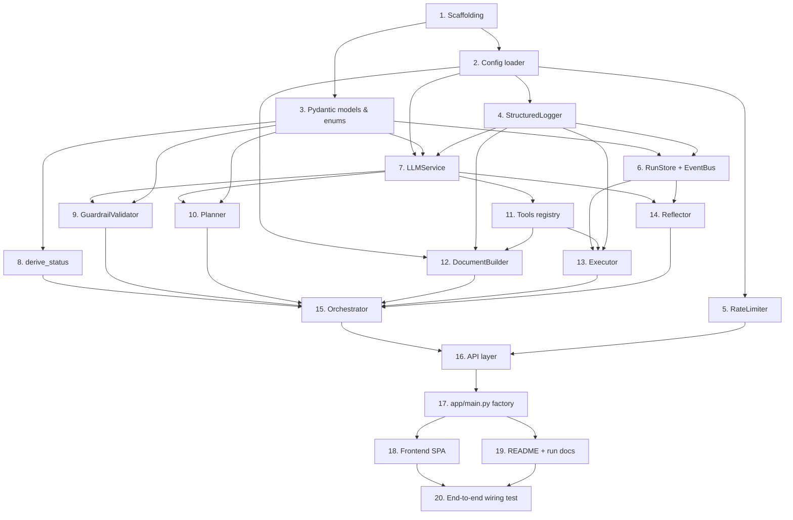

# Implementation Plan: Autonomous Agent Service

## Overview

This plan builds the Autonomous Agent Service bottom-up in Python 3.11+ (FastAPI +
AsyncIO + Pydantic v2), following the layered layout in the design. Each task is a
concrete coding activity that builds on prior tasks, so there is no orphaned code: core
primitives come first (config, models, logging, rate limiter, run store, event bus),
then services (LLM, DocumentBuilder), then the agent loop (guardrail, planner, tools,
executor, reflector, orchestrator), then the API layer, the app factory, and finally the
frontend and end-to-end wiring.

Property-based tests use **Hypothesis** (minimum 100 iterations each, one test per
property, tagged `# Feature: autonomous-agent-service, Property N: ...`). All LLM calls
are exercised through a **fake backend** in tests — no network or paid keys are required.
Test sub-tasks are marked with `*` (optional / skippable for a faster MVP) and are placed
next to the code they validate to catch errors early.

## Task Dependency Graph

## Tasks

- [x] 1. Project scaffolding and package layout
  - Create `pyproject.toml` (project metadata, Python 3.11+, ruff + pytest config incl. `-m property` marker) and `requirements.txt` pinning: `fastapi`, `uvicorn[standard]`, `pydantic>=2`, `pydantic-settings`, `groq`, `httpx`, `python-docx`, `tenacity`, `pytest`, `pytest-asyncio`, `hypothesis`.
  - Create the directory tree with `__init__.py` files: `app/`, `app/api/`, `app/agent/`, `app/services/`, `app/models/`, `app/core/`, `tests/`, plus empty `frontend/` folder.
  - Create `.env.example` listing unconditionally every environment variable from the design's config table (`GROQ_API_KEY`, `GROQ_MODEL`, `OLLAMA_BASE_URL`, `OLLAMA_MODEL`, `LLM_MAX_RETRIES`, `LLM_TIMEOUT_SECONDS`, `HOST`, `PORT`, `RATE_LIMIT_MAX`, `RATE_LIMIT_WINDOW_SECONDS`, `THEME_COLOR`, `DOCUMENT_PREPARED_BY`, `DOCUMENT_OUTPUT_DIR`, `LOG_LEVEL`) each with a safe placeholder and purpose comment.
  - _Requirements: 13.1, 14.2_

- [x] 2. Configuration loader
  - [x] 2.1 Implement `Settings` in `app/core/config.py`
    - Use `pydantic-settings` `BaseSettings` reading all env vars with the documented defaults from the design; include full type hints and docstrings.
    - Expose `THEME_COLOR` such that the DocumentBuilder can resolve it independently of all other configuration.
    - Provide a cached accessor (e.g. `get_settings()`) for singleton use by the app factory.
    - _Requirements: 14.1, 14.5_
  - [x]* 2.2 Write unit tests for `Settings`
    - Verify unset env → documented defaults; set env → overrides applied.
    - _Requirements: 14.1_
  - [x]* 2.3 Write property test that `.env.example` documents every Settings field
    - **Property 20: .env.example documents every configuration variable**
    - Enumerate `Settings` model fields and assert each corresponding env var name appears in `.env.example`.
    - **Validates: Requirements 14.2**

- [x] 3. Pydantic v2 models and enums
  - [x] 3.1 Implement enums and core models in `app/models/schemas.py`
    - Enums: `RunStatus`, `StepStatus` (incl. `SKIPPED`), `IntentClass`, `SSEEventType` (all `str, Enum`).
    - Models: `AgentRequest` (non-blank `field_validator`), `PlanStep` (`step >= 1`, `depends_on`), `Plan` (`min_length=2` + `model_validator` enforcing sequential 1..n numbering), `AgentResponse`, `RunState`.
    - Error bodies: `FieldError`, `ValidationErrorBody`, `RejectionErrorBody`, `PlanningFailureBody`, `RetryAttempt`, `DocumentNotFoundBody`, `RunNotFoundBody`; and `HealthResponse`.
    - _Requirements: 2.1, 2.2, 8.1, 1.1, 5.4, 5.5_
  - [x] 3.2 Implement discriminated SSE event models in `app/models/schemas.py`
    - `BaseEvent` (run_id, type, timestamp) and the seven event models; `AgentEvent` discriminated union keyed on `type`.
    - _Requirements: 6.1, 6.2_
  - [x]* 3.3 Write property test for AgentRequest validation
    - **Property 19: Request validation accepts iff non-blank**
    - **Validates: Requirements 1.1**
  - [x]* 3.4 Write property test for Plan sequential numbering and step content
    - **Property 4: Plan step numbers are sequential 1..n**
    - **Validates: Requirements 2.1**
  - [x]* 3.5 Write property test for Plan JSON round-trip
    - **Property 5: Plan JSON round-trip is identity**
    - **Validates: Requirements 2.2**

- [x] 4. Structured logging
  - [x] 4.1 Implement `StructuredLogger` in `app/core/logging.py`
    - `decision(component, run_id, decision, **fields)` emitting structured JSON; on failure attempt a single stderr fallback write and suppress the error to the caller.
    - `security_event(client_ip, request_hash, reason)` emitting timestamp, IP, request hash, and reason — never the verbatim payload.
    - _Requirements: 15.1, 15.2, 1.5_
  - [x]* 4.2 Write property test that logging failures never break a run
    - **Property 17: Logging failures never break a Run**
    - Inject a failing sink; assert the caller still completes and no exception propagates.
    - **Validates: Requirements 15.1, 15.2**
  - [x]* 4.3 Write property test that malicious rejection logs a hash, not the payload
    - **Property 18: Malicious rejection logs a hash, not the payload**
    - **Validates: Requirements 1.5**

- [x] 5. Rate limiter
  - [x] 5.1 Implement `RateLimiter` in `app/core/rate_limiter.py`
    - Per-IP sliding window over `deque[float]` timestamps; `check(client_ip) -> RateDecision(allowed, retry_after)`; evict stale hits; deny at/over limit; `retry_after` best-effort (deny still returned when it cannot be computed).
    - _Requirements: 1.6, 1.7_
  - [x]* 5.2 Write property test for the sliding-window limiter
    - **Property 16: Rate limiting honors the sliding window**
    - **Validates: Requirements 1.6, 1.7**

- [x] 6. Run store and event bus
  - [x] 6.1 Implement `RunStore` in `app/core/run_store.py`
    - In-memory `dict[str, RunState]`; `create(run_id, request, client_ip)`, `get(run_id) -> RunState | None`, `update(run_state)`; isolation keyed by `run_id`.
    - _Requirements: 16.1, 16.4_
  - [x] 6.2 Implement `EventBus` in `app/core/event_bus.py`
    - `asyncio.Queue` per subscriber keyed by `run_id`; `publish` appends to the run's `RunState.events` replay buffer and fans out only to that run's queues (never raises); `subscribe(run_id)`; `unsubscribe(run_id, queue)` with empty-run cleanup.
    - _Requirements: 6.1, 16.1, 16.2_
  - [x]* 6.3 Write property test that emitted events are well-formed and typed
    - **Property 10: Every emitted SSE event is well-formed and typed**
    - **Validates: Requirements 6.1, 6.2**
  - [x]* 6.4 Write property test that SSE streams are isolated per run
    - **Property 11: SSE streams are isolated per run**
    - Interleave events across multiple concurrent runs; assert a subscriber sees only its run's events.
    - **Validates: Requirements 16.1, 16.2**

- [x] 7. LLM service (Groq primary / Ollama fallback)
  - [x] 7.1 Implement `LLMService` in `app/services/llm.py`
    - `active_backend` property (`groq` iff `GROQ_API_KEY` set, else `ollama`, `unknown` until resolved); `complete(...)`, `complete_json(prompt, schema, ...)`, `health() -> (backend, reachable)`.
    - Internal helpers: `_with_backoff` (exponential backoff, max 3 attempts per backend), `_repair_json` (strip fences, extract first balanced `{...}`/`[...]`, fix trailing commas), `_call_groq`, `_call_ollama` (Groq→Ollama fallback); raise `LLMJSONError` only after repair+retries fail on all backends.
    - Provide a pluggable backend transport interface so a fake backend can be injected in tests.
    - _Requirements: 5.1, 5.2, 5.3, 2.4, 2.5_
  - [x] 7.2 Add a fake LLM backend test fixture in `tests/conftest.py`
    - Configurable scripted successes/failures and canned JSON responses; no network calls.
    - _Requirements: 5.3, 2.4_
  - [x]* 7.3 Write property test for JSON repair correctness
    - **Property 6: JSON repair yields schema-valid output or a clean failure**
    - Generate malformed JSON (code fences, trailing commas, truncation); assert schema-valid result or `LLMJSONError`, never a partial object.
    - **Validates: Requirements 2.4**
  - [x]* 7.4 Write property test for bounded retries and fallback ordering
    - **Property 7: LLM calls are bounded and fall back**
    - **Validates: Requirements 2.4, 2.5, 5.3**
  - [x]* 7.5 Write property test for backend selection
    - **Property 8: Backend selection follows the API key**
    - **Validates: Requirements 5.1, 5.2**

- [x] 8. Status derivation pure function
  - [x] 8.1 Implement `derive_status(steps, artifact_exists, summary)` in `app/agent/orchestrator.py`
    - Pure function returning exactly one `RunStatus`; `completed` iff all steps `done` AND `artifact_exists` AND non-empty summary; on any failed step → `partial` if artifact else `failed`; never `completed` when a step failed.
    - _Requirements: 7.1, 7.2, 7.3, 7.4, 7.5_
  - [x]* 8.2 Write property test that status is never falsely completed
    - **Property 1: Status is never falsely "completed"**
    - **Validates: Requirements 7.2, 7.5**
  - [x]* 8.3 Write property test for the completed iff condition
    - **Property 2: "completed" holds exactly when all success conditions are met**
    - **Validates: Requirements 7.3**
  - [x]* 8.4 Write property test that status is total, in-enum, and deterministic
    - **Property 3: Status is total, in-enum, and deterministic**
    - **Validates: Requirements 7.1, 7.2, 7.4**

- [x] 9. Guardrail validator
  - [x] 9.1 Implement `GuardrailValidator` in `app/agent/guardrail.py`
    - `classify(request) -> IntentClass` via `LLMService.complete_json` with a tiny enum schema; conservative default on ambiguity; returns exactly one of the three `IntentClass` values.
    - _Requirements: 1.3_
  - [x]* 9.2 Write unit tests for guardrail classification
    - Using the fake backend, assert `valid_document_request`, `malicious`, and `non_document` map correctly.
    - _Requirements: 1.3_

- [x] 10. Planner
  - [x] 10.1 Implement `Planner` in `app/agent/planner.py`
    - `make_plan(request) -> Plan` via `complete_json` producing a strict-JSON `Plan` with >=2 sequential steps and enumerated `assumptions`; raise `PlanningError` (carrying retry history) when all backends fail.
    - _Requirements: 2.1, 2.2, 2.3, 2.4, 2.5, 2.6_
  - [x]* 10.2 Write unit test for planning failure escalation
    - With the fake backend failing on all backends, assert `PlanningError` carries `run_id`, reason, and non-empty retry history.
    - _Requirements: 2.6_

- [x] 11. Tools registry and tool implementations
  - [x] 11.1 Implement `ToolRegistry` and tools in `app/agent/tools.py`
    - `ToolResult` dataclass; `ToolRegistry.register/get/dispatch` (raises `ToolError` on unknown tool); implement `research(topic)`, `draft_section(title, context)`, `generate_table_data(spec)` (calling `LLMService`) and `build_docx(sections)` (delegating to `DocumentBuilder`, recording artifact path on `RunState`).
    - _Requirements: 3.2_
  - [x]* 11.2 Write smoke test that all four tools are registered
    - Assert `research`, `draft_section`, `generate_table_data`, `build_docx` resolve via the registry.
    - _Requirements: 3.2_

- [x] 12. Document builder
  - [x] 12.1 Implement `DocumentBuilder` in `app/services/docx_builder.py`
    - Reusable class resolving `theme_color` independently (invalid/unset → documented default + structured warning, continue); `build(...)` produces cover page (title, generation date, prepared-by line), TOC field with `w:updateFields`, theme-colored styled headings, body text, >=1 formatted table, >=1 bullet list, and footer page-number field; returns the written path.
    - _Requirements: 10.1, 10.2, 14.3, 14.4, 14.5_
  - [x]* 12.2 Write property test that generated documents parse and contain required structure
    - **Property 13: Generated documents always parse and contain required structure**
    - Re-open with python-docx; assert title, TOC element, >=1 table, >=1 bullet list, styled headings, footer page-number field.
    - **Validates: Requirements 10.1**
  - [x]* 12.3 Write property test for safe, total theme-color resolution
    - **Property 15: Theme color resolution is safe and total**
    - **Validates: Requirements 14.3, 14.4, 14.5**

- [x] 13. Executor
  - [x] 13.1 Implement `Executor` in `app/agent/executor.py`
    - `run(run_state)` executes steps sequentially: set `running` + emit `step_started`, dispatch tool (with retry), set `done`/`failed` + emit `step_completed`/`step_failed`; on failure record error and continue with steps whose `depends_on` are all `done`; best-effort bookkeeping never crashes the run; `_dependencies_satisfied` leaves unsatisfiable steps `pending`.
    - _Requirements: 3.1, 3.3, 3.4, 3.5_
  - [x]* 13.2 Write property test for step lifecycle and failure continuation
    - **Property 9: Every executed step emits a well-formed lifecycle**
    - **Validates: Requirements 3.1, 3.3, 3.4**
  - [x]* 13.3 Write unit test for best-effort degradation
    - Inject a bookkeeping error; assert the run does not crash.
    - _Requirements: 3.5_

- [x] 14. Reflector
  - [x] 14.1 Implement `Reflector` in `app/agent/reflector.py`
    - `reflect(run_state, assembled_output)` single-pass self-check comparing output to the request; at most ONE revision pass then stop; record findings in the run log and emit a `reflection` event; best-effort (reflection failure never fails the run).
    - _Requirements: 4.1, 4.2, 4.3_
  - [x]* 14.2 Write unit test for single-pass reflection
    - Assert at most one revision pass and that a `reflection` event is emitted with findings recorded.
    - _Requirements: 4.1, 4.2, 4.3_

- [x] 15. Orchestrator wiring
  - [x] 15.1 Implement `Orchestrator.execute_run` in `app/agent/orchestrator.py`
    - Wire validator → planner → executor → reflector → DocumentBuilder; emit `planning_started` → `plan_created` → per-step events → `reflection` → `run_completed`; manage `RunState` in the `RunStore` (isolated by `run_id`); call `derive_status` exactly once at run end; assemble and return `AgentResponse`.
    - _Requirements: 3.1, 4.1, 7.2, 8.1, 16.1_
  - [x]* 15.2 Write property test for the response contract
    - **Property 12: The response contract is always satisfied**
    - Assert `run_id`, `status`, `plan` (with per-step status/summaries), `assumptions`, `clarifications_resolved`, `summary` always present; `document_url` non-null iff artifact exists.
    - **Validates: Requirements 8.1**

- [x] 16. Checkpoint — ensure all core-logic tests pass
  - Ensure all tests pass, ask the user if questions arise.

- [x] 17. API layer
  - [x] 17.1 Implement `POST /agent` in `app/api/agent.py`
    - Rate-limit check (429 + `Retry-After`, still 429 when it cannot be computed) → Pydantic validation (422 `ValidationErrorBody`) → guardrail classify (422 `RejectionErrorBody`, `security_event` on malicious) → create `RunState` and run via Orchestrator → 200 `AgentResponse`; map `PlanningError` → 503 `PlanningFailureBody`.
    - _Requirements: 1.1, 1.2, 1.4, 1.5, 1.6, 1.7, 2.6, 8.1_
  - [x] 17.2 Implement `GET /agent/{run_id}/stream` in `app/api/agent.py`
    - Look up run (404 `RunNotFoundBody`, no stream opened, on unknown); subscribe, replay buffered events, then stream live; SSE frames with `event:`/`id:`/`data:`; keep-alive comment every ~15s; unsubscribe/cleanup on disconnect and after terminal `run_completed`.
    - _Requirements: 6.1, 6.2, 6.3, 16.2_
  - [x] 17.3 Implement `GET /documents/{run_id}.docx` in `app/api/documents.py`
    - 200 with file bytes + `Content-Type` docx + `Content-Disposition` filename derived from `run_id`; 404 `DocumentNotFoundBody` with reason `unknown_run` / `in_progress` / `failed_no_document`.
    - _Requirements: 9.1, 9.2, 9.3, 9.4, 16.3, 16.4_
  - [x] 17.4 Implement `GET /health` and `GET /health/ready` in `app/api/health.py`
    - `/health` always 200 `HealthResponse` with active backend / `backend_ready`; unresolved backend → `unknown` / `false` / `detail`; `/health/ready` 200 when a backend is reachable, 503 when none is.
    - _Requirements: 5.4, 5.5, 5.6_
  - [x]* 17.5 Write property test for idempotent, isolated document retrieval
    - **Property 14: Document retrieval is idempotent and isolated**
    - **Validates: Requirements 9.2, 9.3, 16.3**
  - [x]* 17.6 Write API integration tests for status codes and headers
    - 422 (schema + guardrail), 429 + `Retry-After`, 503 planning failure, 404 reason codes (stream + document), health edge states, docx `Content-Type`/`Content-Disposition`.
    - _Requirements: 1.2, 1.4, 1.6, 2.6, 5.5, 5.6, 6.3, 9.1, 9.4_

- [x] 18. FastAPI app factory
  - [x] 18.1 Implement `create_app()` and lifespan in `app/main.py`
    - App factory instantiating singletons (`Settings`, `StructuredLogger`, `RateLimiter`, `RunStore`, `EventBus`, `LLMService`, `DocumentBuilder`, `ToolRegistry`, `GuardrailValidator`, `Planner`, `Executor`, `Reflector`, `Orchestrator`) in a lifespan handler; mount the `agent`, `documents`, and `health` routers; serve `frontend/` as static files with `index.html` at the root.
    - _Requirements: 13.1, 13.2_
  - [x]* 18.2 Write structure smoke test
    - Assert required modules/layers exist and the app mounts routes and static files.
    - _Requirements: 13.1_

- [x] 19. Mission-control frontend
  - [x] 19.1 Implement `frontend/index.html`
    - Idle state: large centered input, one-line service description, two example chips (the concrete CRM-migration request and the ambiguous leadership-meeting request); hidden Plan_Step timeline; assumptions panel, reasoning log, and result card containers.
    - _Requirements: 11.1, 11.2, 12.1_
  - [x] 19.2 Implement `frontend/app.js`
    - On submit: `POST /agent`, then open `EventSource` on `/agent/{run_id}/stream` (replay + live); animated timeline transitioning steps pending→running→done/failed and rendering remaining `pending` as `skipped` on run end; monospace reasoning log line per event; assumptions panel; result card with summary, final status (incl. `partial` with per-step detail) and Download .docx button when an artifact exists.
    - _Requirements: 11.3, 11.4, 11.5, 11.6, 11.7, 12.2_
  - [x] 19.3 Implement `frontend/styles.css`
    - Dark mission-control theme: single amber accent, 2–3 neutrals, monospace typeface for logs, functional status colors, no purple hues, no gradient fills, subtle motion with reduced-motion support.
    - _Requirements: 11.8_
  - [x]* 19.4 Write frontend checks
    - Assert idle-state markup (centered input, both chips, one-line description), timeline hidden until submit, and a CSS token lint asserting single accent / no gradients / no purple.
    - _Requirements: 11.1, 11.2, 11.8, 12.1_

- [x] 20. README and run documentation
  - Write `README.md` with setup instructions, a mermaid architecture diagram, both predefined test inputs verbatim, and an explanation of the engineering improvements (multi-step planning [primary] plus reflection and retry/fallback: what/why/how); document commands to run the backend (`uvicorn app.main:app`) and access the frontend.
  - _Requirements: 13.3_

- [x] 21. End-to-end wiring integration test
  - [x] 21.1 Write an end-to-end integration test in `tests/test_api.py`
    - Using the fake LLM backend producing a valid plan and section content, drive `POST /agent` through to a completed run; assert a downloadable `.docx` is served by `/documents/{run_id}.docx`, the SSE stream replays the full event sequence, and no placeholder/stub code paths remain (every wired component is exercised).
    - _Requirements: 3.1, 6.1, 8.1, 9.1, 10.1, 16.1_

- [x] 22. Final checkpoint — ensure all tests pass
  - Ensure all tests pass, ask the user if questions arise.

## Notes

- Tasks marked with `*` are optional test sub-tasks and can be skipped for a faster MVP; core implementation tasks are never optional.
- Each task references specific requirement sub-clauses and, where applicable, the design correctness property it implements.
- Property tests use Hypothesis at a minimum of 100 iterations, one test per property (P1–P20), each tagged `# Feature: autonomous-agent-service, Property N: ...`, and placed next to the code they validate.
- All LLM interactions are exercised via a fake backend in tests — no network access or paid keys required.
- Checkpoints provide incremental validation points before the API layer and at the end.
