# Autonomous Agent Service

Turn a plain-language business request into a polished Microsoft Word (`.docx`)
deliverable — fully autonomously. You describe what you need ("a project proposal
for migrating our CRM to the cloud"); the agent **plans** an ordered set of steps,
**executes** each step through tool calls, **self-checks** its own draft, and hands
back a formatted Word document with a cover page, table of contents, styled
headings, tables, and page numbers.

The service is a **FastAPI** backend paired with a dark **"mission control"**
single-page web console that streams the agent's reasoning live as it works. It is
designed to run locally with **zero paid API keys**: it uses the **Groq free tier**
(model `llama-3.3-70b-versatile`) when a key is present and **automatically falls
back to a local Ollama** backend when it is not.

The core is a clean **Planner → Executor → Reflector** loop, with each
responsibility isolated in its own class.

---

## Features

- **Autonomous multi-step planning** — the Planner turns a request into a
  structured, ordered JSON plan (≥ 2 steps) and enumerates its assumptions for
  ambiguous requests.
- **Planner → Executor → Reflector loop** — plan, execute each step via tools,
  then a single self-check pass reviews and optionally revises the output.
- **Request guardrails & validation** — Pydantic schema validation plus an
  LLM intent classifier (`valid_document_request` / `malicious` / `non_document`),
  per-IP rate limiting, and security-event logging that records a hash, never the
  payload.
- **Live SSE streaming** — the web console watches the run unfold in real time:
  planning, each step's lifecycle, reflection, and completion.
- **Resilient LLM calls** — exponential-backoff retries (up to 3 per backend),
  JSON repair on malformed model output, and automatic Groq → Ollama fallback;
  a failed step never halts the rest of the run.
- **Professional Word deliverables** — a reusable `DocumentBuilder` (python-docx)
  emits a cover page, table of contents, theme-colored headings, body text, at
  least one table, at least one bullet list, and footer page numbers.
- **Honest status derivation** — a pure `derive_status` function computes the
  final run status exactly once and never reports `completed` when a step failed.
- **Mission-control web console** — a dark, single-accent UI with an animated
  step timeline, an assumptions panel, a monospace reasoning log, and a
  download button for the finished document.
- **Zero paid API keys** — runs entirely on the Groq free tier or a local Ollama
  model.

---

## Architecture

The service is a layered, single-process async application. HTTP and SSE requests
enter through the **API layer**. A validated request flows through the
**GuardrailValidator**, then the **Orchestrator** wires the
**Planner → Executor/Tools → Reflector** loop, drives the **DocumentBuilder**, and
publishes events to a per-run **EventBus**. Cross-cutting concerns (config,
logging, rate limiting, run state, event bus) live in `app/core/`.

```mermaid
flowchart TB
    subgraph Client
        UI[Mission Control Web Console<br/>single-page app]
    end

    subgraph API[API Layer  app/api]
        R_AGENT[POST /agent]
        R_STREAM[GET /agent/&#123;run_id&#125;/stream]
        R_DOC[GET /documents/&#123;run_id&#125;.docx]
        R_HEALTH[GET /health]
        R_READY[GET /health/ready]
    end

    subgraph Core[app/core]
        RL[RateLimiter<br/>per-IP sliding window]
        RS[RunStore<br/>run_id to RunState]
        EB[EventBus<br/>asyncio.Queue per run]
        CFG[Config]
        LOG[Structured Logging]
    end

    subgraph Agent[app/agent]
        GV[GuardrailValidator]
        ORCH[Orchestrator]
        PL[Planner]
        EX[Executor]
        RF[Reflector]
        TOOLS[Tools registry<br/>research / draft_section /<br/>generate_table_data / build_docx]
    end

    subgraph Services[app/services]
        LLM[LLMService<br/>Groq primary / Ollama fallback]
        DOCX[DocumentBuilder<br/>python-docx]
    end

    UI -->|POST request| R_AGENT
    UI -->|EventSource subscribe| R_STREAM
    UI -->|Download| R_DOC

    R_AGENT --> RL --> GV --> ORCH
    ORCH --> PL --> LLM
    ORCH --> EX --> TOOLS
    TOOLS --> LLM
    TOOLS --> DOCX
    ORCH --> RF --> LLM
    ORCH --> RS
    ORCH -->|publish events| EB
    R_STREAM -->|subscribe| EB
    R_STREAM --> RS
    R_DOC --> RS
    R_HEALTH --> LLM
    R_READY --> LLM
    GV --> LLM
    LLM -->|Groq SDK| GROQ[(Groq API)]
    LLM -->|HTTP| OLLAMA[(Local Ollama)]
```



**Flow in words:** `POST /agent` is rate-limited, schema-validated, and screened
by the guardrail. The Orchestrator then creates a run, emits `planning_started`,
asks the Planner for a plan (`plan_created`), runs each step through the Executor
and its tools (`step_started` → `step_completed` / `step_failed`), performs one
reflection pass (`reflection`), assembles the `.docx`, computes the final status
once via `derive_status`, and emits `run_completed`. The web console opens the SSE
stream to visualize every one of these events, replaying any it missed.

---

## Project Structure

```
autonomus-site/
├── app/
│   ├── __init__.py
│   ├── main.py                     # FastAPI app factory, router mounting, static files, lifespan
│   ├── api/
│   │   ├── agent.py                # POST /agent, GET /agent/{run_id}/stream
│   │   ├── documents.py            # GET /documents/{run_id}.docx
│   │   ├── health.py               # GET /health, GET /health/ready
│   │   └── deps.py                 # FastAPI dependency accessors for app.state singletons
│   ├── agent/
│   │   ├── orchestrator.py         # Orchestrator + derive_status pure function
│   │   ├── planner.py              # Planner (structured JSON plan)
│   │   ├── executor.py             # Executor (sequential step execution via tools)
│   │   ├── reflector.py            # Reflector (single-pass self-check)
│   │   ├── guardrail.py            # GuardrailValidator (intent classification)
│   │   └── tools.py                # Tool registry + tool implementations
│   ├── services/
│   │   ├── llm.py                  # LLMService (Groq primary / Ollama fallback)
│   │   └── docx_builder.py         # DocumentBuilder (python-docx)
│   ├── models/
│   │   └── schemas.py              # All Pydantic v2 models + enums
│   └── core/
│       ├── config.py               # Settings loaded from env (pydantic-settings)
│       ├── logging.py              # Structured logging + safe fallback
│       ├── rate_limiter.py         # In-memory per-IP sliding window
│       ├── run_store.py            # In-memory run_id -> RunState store
│       └── event_bus.py            # asyncio.Queue per run: subscribe/publish/replay
├── frontend/
│   ├── index.html                  # Mission-control single-page console
│   ├── app.js                      # SSE subscription + timeline rendering
│   └── styles.css                  # Dark theme, amber accent, monospace logs
├── tests/                          # pytest + Hypothesis property tests (fake LLM backend)
├── README.md
├── .env.example                    # Every env var, placeholders + comments
├── requirements.txt
└── pyproject.toml
```

---

## Setup

### Prerequisites

- **Python 3.11+**
- *(Optional)* A **Groq** free-tier API key for the primary backend.
- *(Optional)* A local **Ollama** install for the offline fallback backend.

### 1. Create a virtual environment and install dependencies

```bash
python -m venv .venv && source .venv/bin/activate && pip install -r requirements.txt
```

### 2. Create your environment file

```bash
cp .env.example .env
```

The service runs **with no `GROQ_API_KEY`** — when the key is blank it
automatically falls back to a local Ollama backend, so you can demo it with zero
paid keys.

- **Groq (optional, recommended primary):** the Groq free tier is available at no
  cost. Create a free account and generate an API key from the
  [Groq console](https://console.groq.com/keys), then set `GROQ_API_KEY=` in your
  `.env`. When the key is set, the service uses Groq with model
  `llama-3.3-70b-versatile`.
- **Ollama (local fallback):** install Ollama from
  [ollama.com](https://ollama.com/download), then pull the model used by the
  fallback backend:

  ```bash
  ollama pull llama3.1
  ```

  With no Groq key configured, the service talks to Ollama at
  `http://localhost:11434` (configurable via `OLLAMA_BASE_URL`).

### 3. Run the backend

```bash
uvicorn app.main:app --reload
```

This single command serves **both the API and the web console** from the same
process.

### 4. Open the web console

The frontend is served by the **same uvicorn process at the root URL** — there is
no separate frontend server or build step. Once the backend is running, open:

```
http://localhost:8000/
```

in your browser. That is the single command needed to run the UI.

---

## API Reference

### `POST /agent`

Runs the agent synchronously and returns the full result when the run finishes.

**Request**

```json
{
  "request": "Create a project proposal for migrating our on-premise CRM to the cloud."
}
```

**Response — `200 OK` (`AgentResponse`)**

```json
{
  "run_id": "3f9a1c8e2b7d4e5f9a0b1c2d3e4f5a6b",
  "status": "completed",
  "plan": {
    "steps": [
      {
        "step": 1,
        "task": "Research CRM cloud migration",
        "description": "Gather key considerations for the migration.",
        "expected_output": "Research notes",
        "status": "done",
        "output_summary": "Summarized migration drivers, risks, and phases.",
        "error": null,
        "depends_on": []
      },
      {
        "step": 2,
        "task": "Assemble the Word document",
        "description": "Build the final .docx deliverable.",
        "expected_output": "Formatted proposal",
        "status": "done",
        "output_summary": "Generated the proposal document.",
        "error": null,
        "depends_on": [1]
      }
    ],
    "assumptions": []
  },
  "assumptions": [],
  "clarifications_resolved": [],
  "summary": "A project proposal covering migration drivers, phases, budget, and timeline.",
  "document_url": "/documents/3f9a1c8e2b7d4e5f9a0b1c2d3e4f5a6b.docx"
}
```

`document_url` is present only when a document artifact exists.

**Other responses**

| Status | Condition |
|---|---|
| `422` | Body fails schema validation (`validation_error`) **or** guardrail rejects the request as `malicious` / `non_document` (`request_rejected`). |
| `429` | Over the per-IP rate limit; includes a `Retry-After` header. |
| `503` | Planning failed on all backends (`planning_failed`, with `run_id`, reason, and retry history). |

### `GET /agent/{run_id}/stream`

Server-Sent Events stream for a run. Returns `404` (without opening a stream) for
an unknown `run_id`. Each frame carries `run_id`, `type`, `timestamp`, and the
event payload. Event names:

- `planning_started`
- `plan_created`
- `step_started`
- `step_completed`
- `step_failed`
- `reflection`
- `run_completed`

The endpoint first **replays** all buffered events for the run, then streams live
events until the terminal `run_completed`, so a console that connects late still
sees the full history.

### `GET /documents/{run_id}.docx`

Downloads the generated Word document.

- `200` — file bytes with
  `Content-Type: application/vnd.openxmlformats-officedocument.wordprocessingml.document`
  and a `Content-Disposition` filename derived from the `run_id`. Retrieval is
  idempotent (byte-identical on repeat requests).
- `404` — `DocumentNotFoundBody` with a `reason` of `unknown_run`, `in_progress`,
  or `failed_no_document`.

### `GET /health`

Always returns `200` with the active LLM backend and readiness:

```json
{ "status": "ok", "llm_backend": "ollama", "backend_ready": true, "detail": null }
```

When the backend is unresolved, it reports `"llm_backend": "unknown"`,
`"backend_ready": false`, and an explanatory `detail`.

### `GET /health/ready`

Readiness probe: `200` when an LLM backend is reachable, `503` when none is.

---

## Predefined Test Inputs

The web console ships with two example request chips so you can immediately
exercise a concrete request and an ambiguous one:

1. **Concrete:**

   > Create a project proposal for migrating our on-premise CRM to the cloud.

2. **Ambiguous:**

   > We need something for the leadership meeting next week about the new product... it should cover the important stuff, budget maybe, and the timeline isn't final. Make it look official.

Input **#2** is deliberately vague about the document type, scope, and finality of
the timeline. When it is submitted, the agent **autonomously chooses a document
type** and **states its assumptions** (surfaced in the response's `assumptions`
list and in the console's assumptions panel) rather than asking for clarification —
demonstrating autonomous handling of ambiguity.

---

## Engineering Improvements

### 1. Multi-step planning — *primary improvement*

- **What:** Instead of one-shot generation, the Planner asks the LLM to produce a
  **structured JSON plan** — an ordered list of steps (each with a step number,
  task, description, and expected output) plus an explicit list of assumptions.
- **Why:** It makes the agent's process **transparent** (each step streams to the
  console), **decomposes** a large request into tractable tool calls, and lets the
  agent **handle ambiguity autonomously** by enumerating its assumptions rather
  than stalling for clarification.
- **How:** The `Planner` calls `LLMService.complete_json` against a strict
  Pydantic `Plan` schema. The schema enforces the plan's integrity with a
  `min_length=2` constraint (at least two steps) and a `model_validator` that
  requires **sequential 1..n step numbering**; malformed model output is treated
  as unparseable and triggers JSON repair + retry. For ambiguous requests the
  prompt instructs the model to enumerate each assumption, which is recorded on
  the run and returned in the response.

### 2. Reflection / self-check — *bonus*

- **What:** After execution, the Reflector reviews the assembled output against
  the original request and revises weak or missing sections.
- **Why:** A cheap **self-correction** pass meaningfully improves how well the
  deliverable matches the request, without an unbounded, expensive edit loop.
- **How:** The `Reflector` performs a **single-pass** review comparing the output
  to the request and applies **at most one** revision pass, then stops
  regardless of any newly identified weaknesses. It records its findings in the
  run log and emits a `reflection` SSE event. Reflection is best-effort — a
  failure here never fails the run.

### 3. Retry & fallback — *bonus*

- **What:** Every LLM call is wrapped with retries, JSON repair, and automatic
  backend fallback; per-step failures do not abort the whole run; and the final
  status is derived honestly.
- **Why:** Free-tier and local models are occasionally flaky or emit malformed
  JSON. Bounded resilience keeps a run producing value under partial failure
  while never overstating success.
- **How:** `LLMService` applies **exponential backoff with up to 3 retries** per
  backend, runs a **JSON-repair** pass (strip code fences, extract the first
  balanced braces, fix trailing commas) before giving up, and falls back
  **Groq → Ollama** when the primary backend is exhausted. The Executor marks a
  failed step `failed`, records the error, and **continues** with remaining steps
  whose dependencies are satisfied. Finally, the pure `derive_status` function
  computes the run status exactly once and **never returns `completed` when any
  step failed** (it reports `partial` when a usable document exists, `failed`
  otherwise).

---

## Testing

Run the full test suite:

```bash
pytest
```

Run only the property-based tests:

```bash
pytest -m property
```

The project uses a **dual testing approach**:

- **Example-based unit and integration tests** cover concrete scenarios, error
  shapes, status codes, and headers.
- **Property-based tests** (using [Hypothesis](https://hypothesis.readthedocs.io/))
  verify **20 correctness properties** (P1–P20) that must hold across large input
  spaces — status derivation, plan structure, JSON repair, retry bounding, event
  well-formedness and isolation, document structure, rate limiting, and config
  resolution. Each property test runs a minimum of 100 iterations and is tagged
  `# Feature: autonomous-agent-service, Property N: ...`.

**All LLM calls are exercised through a fake backend in tests** — no network
access and no API keys are required to run the suite.

---

## Configuration

All configuration comes from environment variables (with documented defaults),
loaded via `pydantic-settings`. `.env.example` lists every variable
unconditionally with a safe placeholder and a purpose comment.

| Variable | Default | Purpose |
|---|---|---|
| `GROQ_API_KEY` | *(unset)* | Groq free-tier key; when set → Groq primary, else Ollama fallback. |
| `GROQ_MODEL` | `llama-3.3-70b-versatile` | Groq model name (primary backend). |
| `OLLAMA_BASE_URL` | `http://localhost:11434` | Local Ollama endpoint (fallback backend). |
| `OLLAMA_MODEL` | `llama3.1` | Ollama model name. |
| `LLM_MAX_RETRIES` | `3` | Max retries per backend before falling back / failing. |
| `LLM_TIMEOUT_SECONDS` | `60` | Per-LLM-call timeout in seconds. |
| `HOST` | `0.0.0.0` | Server bind host. |
| `PORT` | `8000` | Server port. |
| `RATE_LIMIT_MAX` | `10` | Requests allowed per window per IP. |
| `RATE_LIMIT_WINDOW_SECONDS` | `60` | Sliding-window size in seconds. |
| `THEME_COLOR` | `1F4E79` | Heading theme color (6-digit hex, no `#`); invalid → default + warning. |
| `DOCUMENT_PREPARED_BY` | `Autonomous Agent Service` | Cover-page "Prepared by" line. |
| `DOCUMENT_OUTPUT_DIR` | `./generated` | Directory where generated `.docx` files are written. |
| `LOG_LEVEL` | `INFO` | Logging verbosity. |

---

## Zero Paid Keys

This service is built to run with **no paid API keys**. Leave `GROQ_API_KEY` blank
and the `LLMService` automatically selects a **local Ollama** backend; set a
**free-tier Groq** key and it uses Groq as the primary with Ollama as an automatic
fallback. Either way, you can build real Word deliverables locally without paying
for an API — and the entire test suite runs against a fake backend with no network
access at all.
